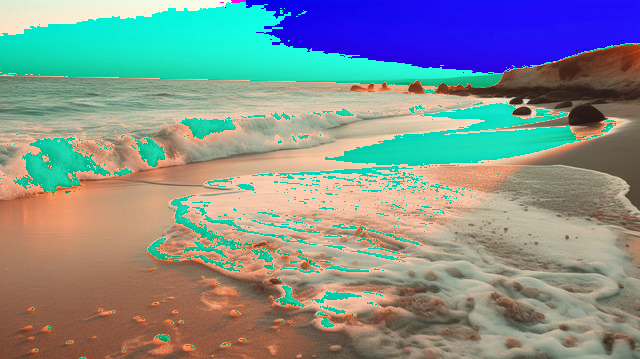
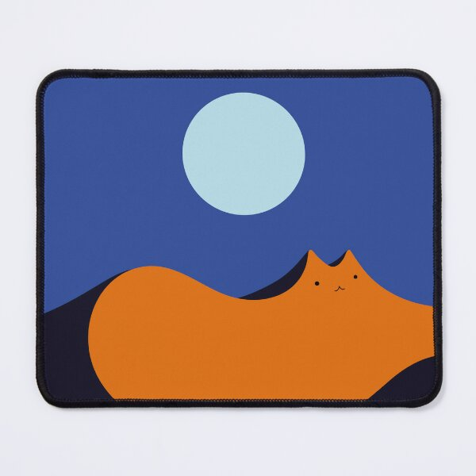
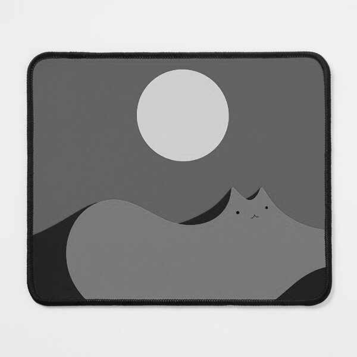
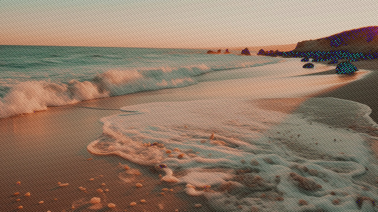

# CSE 8A Winter 2026 PA5

**Due Date: Sunday, February 22, 2026 11:59 PM PST**

## Provided Files
- `CSE8AImage.py` (Image processing library - **DO NOT EDIT**)
- Sample test images: `beach.jpg` and `cat_sand_dune.jpg` --- for testing your functions)

## File(s) to Submit
- `brighten.py`
- `grayscale.py`
- `add_noise.py`

(Details on how to submit your files can be found below)

---

## Part 0. Environment Setup

**If you completed Tuesday's lab setup, you can skip to Part 1!**

Otherwise, follow the instructions below for your computer.

### Step 1: Download Starter Files

**IMPORTANT: Do this first!**

You need to download the `CSE8AImage.py` file and the sample test images. You have two options:

**Option 1: Download from GitHub (Recommended)**

1. Click the green "Code" button
2. Select "Download ZIP"
3. Extract the ZIP file to your working folder
4. You should now have `CSE8AImage.py` and the sample images in your folder

**Option 2: Download from Canvas**

1. Go to Canvas and find the PA5 assignment
2. Download `CSE8AImage.py` and save it in your working folder
3. Download the sample test images and save them in the same folder

Make sure `CSE8AImage.py` is in the **same folder** as your Python files for this assignment to work.

### Step 2: Install numpy and pillow

Before you can use the `CSE8AImage` library, you need to install two Python packages: `numpy` and `pillow`.

---

### Setup Instructions for Mac

#### Check if you have pip installed

Open the **Terminal** app and type the following command:

```bash
pip3 --version
```

If you see a version number (e.g., `pip 23.0.1`), you have pip installed. Skip to `"Install numpy and pillow for Mac"` below.

If you get an error message, you need to install `pip` first.

#### Install pip (if needed)

In Terminal, run these commands:

```bash
curl https://bootstrap.pypa.io/get-pip.py -o get-pip.py
```

```bash
python3 get-pip.py
```

#### Install numpy and pillow for Mac

In Terminal, try the following command:

```bash
pip3 install numpy pillow
```

**If that doesn't work on your computer**, try these alternatives in order:

```bash
python3 -m pip install numpy pillow
```

```bash
python -m pip install numpy pillow
```

```bash
py -m pip install numpy pillow
```

Upon successful installation, you should see messages similar to the following:

```
Downloading numpy-2.1.3-cp311-cp311-macosx_14_0_arm64.whl (5.4 MB)
Downloading pillow-11.0.0-cp311-cp311-macosx_11_0_arm64.whl (3.0 MB)
Installing collected packages: pillow, numpy
Successfully installed numpy-2.1.3 pillow-11.0.0
```

If you already have the packages installed, you'll see messages similar to the following:

```
Requirement already satisfied: numpy in /Library/Frameworks/...
Requirement already satisfied: pillow in /Library/Frameworks/...
```

---

### Setup Instructions for Windows

#### Check if you have pip installed

Open **Command Prompt** and type the following command:

```bash
pip --version
```

If you see a version number, you have pip installed. Skip to `"Install numpy and pillow for Windows"` below.

If you get an error message, you need to install `pip` first.

#### Install pip (if needed)

In Command Prompt, run these commands:

```bash
curl https://bootstrap.pypa.io/get-pip.py -o get-pip.py
python get-pip.py
```

#### Install numpy and pillow for Windows

In Command Prompt, try the following command:

```bash
pip install numpy pillow
```

**If that doesn't work on your computer**, try these alternatives in order:

```bash
python -m pip install numpy pillow
```

```bash
py -m pip install numpy pillow
```

```bash
python3 -m pip install numpy pillow
```

Upon successful installation, you'll see messages similar to the following:

```
Downloading numpy-2.1.3-cp311-cp311-win_amd64.whl (5.4 MB)
Downloading pillow-11.0.0-cp311-cp311-win_amd64.whl (3.0 MB)
Installing collected packages: pillow, numpy
Successfully installed numpy-2.1.3 pillow-11.0.0
```

If you already have the packages installed, you'll see messages similar to the following:

```
Requirement already satisfied: numpy in ...
Requirement already satisfied: pillow in ...
```

---

### Testing Your Setup

To verify your setup is working correctly:

1. Open **IDLE**
2. Create a new Python file in the **same folder** where you saved `CSE8AImage.py`
3. Type the following code:

```python
from CSE8AImage import *

# This should run without errors
test_image = create_img(5, 5, (255, 0, 0))
print("Setup successful!")
```

4. Run the file (Run → Run Module)

If you see "Setup successful!" printed, you're ready to start the assignment!

**If you encounter any issues**, please see a tutor, TA, or instructor during office hours/tutor hours.

---

## Part 1. Implementation (100 points)

In this programming assignment, you will implement three image processing functions that transform images in different ways. Each function will be in a separate Python file and tested independently on Gradescope.

Please get started as soon as possible. Start early, start often.

### Overview of the Three Functions

1. **`brighten_image(img, percentage)`** - Increases the brightness of an image by a given percentage
2. **`grayscale(img)`** - Converts a color image to grayscale
3. **`add_noise(img)`** - Adds a deterministic "salt and pepper" noise effect to an image

---

## Part 2. Function 1: `brighten_image` (35 points)

### Part 2.1 Task Description

Your task is to write a function that makes an image brighter by increasing each color channel (red, green, and blue) by a specified percentage. The function takes an image and a brightness percentage as parameters and returns a new brightened image.

### Part 2.2 Implementation Details

1. Create a new file called `brighten.py`. The file name must match exactly to pass the tests.

2. At the top of your file, import the CSE8AImage library:
   ```python
   from CSE8AImage import *
   ```

3. Define a function called `brighten_image` that takes two parameters:
   - `img`: a 2D list of tuples representing the image (each tuple is `(red, green, blue)`)
   - `percentage`: an integer representing how much brighter to make the image (e.g., `30` means 30% brighter)

4. This function takes in an image and a brightness percentage and returns a **new image** (2D list of tuples) where each pixel is brighter. You should follow these rules:

   * **Rule 1:** The `percentage` parameter represents how much brighter the image should be. For example:
     - `percentage = 30` means make the image 30% brighter (multiply each color value by 1.30)
     - `percentage = 50` means make the image 50% brighter (multiply each color value by 1.50)
     - `percentage = 0` means no change (multiply each color value by 1.00)

   * **Rule 2:** To calculate the new color values:
     - Calculate the multiplier: `1 + (percentage/100)`
     - For example, if `percentage = 30`, the multiplier is `1.30`
     - Apply this multiplier to **each** color channel `(red, green, and blue)` **independently**

   * **Rule 3:** After multiplying, the result might be a decimal number. You must convert it to an integer using `int()`. This will truncate (remove) the decimal part.
     - For example, `int(156.7)` becomes `156`

   * **Rule 4:** Color values must stay in the valid range of 0-255. After multiplying and converting to int:
     - If a color value exceeds 255, use **modulo 256** to wrap it back into range
     - The formula is: `new_value % 256`
     - For example, if a calculation gives you `280`, use `280 % 256 = 24`

   * **Rule 5:** You must create and return a **new image**. Do NOT modify the original image that was passed in. Call the `create_img()` function from the `CSE8AImage.py` file to create a new blank image, then fill it with the brightened pixel values.

   * **Rule 6:** Your function must return a 2D list of tuples (an image). Do NOT import any libraries other than `CSE8AImage`.

5. Implement the logic:

   Think about how you would approach this problem:
   - How can you get the dimensions of the input image?
   - How will you iterate through every pixel?
   - For each pixel, how will you calculate the new color values?
   - How will you store the new pixel values?

   **Hint:** You'll need to use `height()`, `width()`, `create_img()`, and nested for loops.

```python
def brighten_image(img, percentage):

    # 1. Get image dimensions using height(img) and width(img)
    # 2. Calculate multiplier: 1 + (percentage / 100)
    # 3. Create new blank image
    # 4. Use nested loops to process each pixel
    # 5. For each pixel: new_value = int(old_value * multiplier) % 256
    # 6. Return the new brightened image
    
    return new_img
```

### Part 2.3 Examples

Here are **some** examples of how your `brighten_image` function should behave:

```python
# Example 1: Single red pixel, 30% brighter
>>> test_img = [[(100, 0, 0)]]
>>> result = brighten_image(test_img, 30)
>>> print(result)
[[(130, 0, 0)]]
# Explanation: 
#   multiplier = 1 + (30/100) = 1.30
#   new_red = int(100 * 1.30) % 256 = int(130.0) % 256 = 130 % 256 = 130
#   new_green = int(0 * 1.30) % 256 = 0
#   new_blue = int(0 * 1.30) % 256 = 0

# Example 2: Single pixel with all channels, 50% brighter
>>> test_img = [[(100, 80, 60)]]
>>> result = brighten_image(test_img, 50)
>>> print(result)
[[(150, 120, 90)]]
# Explanation:
#   multiplier = 1 + (50/100) = 1.50
#   new_red = int(100 * 1.50) % 256 = 150
#   new_green = int(80 * 1.50) % 256 = 120
#   new_blue = int(60 * 1.50) % 256 = 90

# Example 3: No brightness change
>>> test_img = [[(100, 100, 100)]]
>>> result = brighten_image(test_img, 0)
>>> print(result)
[[(100, 100, 100)]]
# Explanation:
#   multiplier = 1 + (0/100) = 1.00
#   All values remain unchanged

# Example 4: Values that exceed 255 wrap around using modulo
>>> test_img = [[(200, 150, 100)]]
>>> result = brighten_image(test_img, 50)
>>> print(result)
[[(44, 225, 150)]]
# Explanation:
#   multiplier = 1.50
#   new_red = int(200 * 1.50) % 256 = 300 % 256 = 44
#   new_green = int(150 * 1.50) % 256 = 225 % 256 = 225
#   new_blue = int(100 * 1.50) % 256 = 150 % 256 = 150

# Example 5: Truncating decimals
>>> test_img = [[(101, 0, 0)]]
>>> result = brighten_image(test_img, 30)
>>> print(result)
[[(131, 0, 0)]]
# Explanation:
#   new_red = int(101 * 1.30) % 256 = int(131.3) % 256 = 131 % 256 = 131

# Example 6: Black pixel
>>> test_img = [[(0, 0, 0)]]
>>> result = brighten_image(test_img, 50)
>>> print(result)
[[(0, 0, 0)]]
# Explanation:
#   All values are 0, so 0 * 1.50 = 0

# Example 7: 1x2 image (two pixels in one row)
>>> test_img = [[(100, 50, 0), (200, 100, 50)]]
>>> result = brighten_image(test_img, 20)
>>> print(result)
[[(120, 60, 0), (240, 120, 60)]]
# Explanation:
#   multiplier = 1.20
#   Pixel [0][0]: (100*1.20, 50*1.20, 0*1.20) = (120, 60, 0)
#   Pixel [0][1]: (200*1.20, 100*1.20, 50*1.20) = (240, 120, 60)

# Example 8: 2x2 image (testing nested loops)
>>> test_img = [[(100, 100, 100), (100, 100, 100)],
                [(100, 100, 100), (100, 100, 100)]]
>>> result = brighten_image(test_img, 20)
>>> print(result)
[[(120, 120, 120), (120, 120, 120)], [(120, 120, 120), (120, 120, 120)]]
# Explanation:
#   All pixels have the same value, so all become (120, 120, 120)

# Example 9: 2x2 image with different values
>>> test_img = [[(100, 50, 0), (200, 100, 50)],
                [(150, 75, 25), (50, 25, 10)]]
>>> result = brighten_image(test_img, 30)
>>> print(result)
[[(130, 65, 0), (4, 130, 65)], [(195, 97, 32), (65, 32, 13)]]
# Explanation:
#   multiplier = 1.30
#   Pixel [0][0]: (130, 65, 0)
#   Pixel [0][1]: (int(200*1.30)%256, int(100*1.30)%256, int(50*1.30)%256)
#                 = (260%256, 130, 65) = (4, 130, 65)
#   Pixel [1][0]: (195, 97, 32)
#   Pixel [1][1]: (65, 32, 13)

# Example 10: High percentage (100% brighter)
>>> test_img = [[(150, 100, 200)]]
>>> result = brighten_image(test_img, 100)
>>> print(result)
[[(44, 200, 144)]]
# Explanation:
#   multiplier = 2.00
#   new_red = int(150 * 2.00) % 256 = 300 % 256 = 44
#   new_green = int(100 * 2.00) % 256 = 200 % 256 = 200
#   new_blue = int(200 * 2.00) % 256 = 400 % 256 = 144
```

**Note:** We will be testing your function with both manually created 2D lists (like the examples above) AND actual image files. Make sure your function works correctly for both!

### Part 2.4 Testing Your Function

Create a new file (e.g., `test_brighten.py`) in the same folder:

```python
from brighten import brighten_image
from CSE8AImage import *

# Test with a simple 2D list
test_img = [[(100, 100, 100)]]
result = brighten_image(test_img, 30)
print("Result:", result)
print("Expected: [[(130, 130, 130)]]")

# Test with a real image file
my_img = load_img("beach.jpg") # change file name if using different file to test
brighter = brighten_image(my_img, 40)
save_img(brighter, "brighten_output.jpg")
print("Brightened image saved! Open brighten_output.jpg to see the result.")
```

**Testing with provided images:** We provide sample images like `beach.jpg` and `cat_sand_dune.jpg`. If your function is working correctly:
- The brightened image should look visibly brighter than the original
- Some colors should be more vivid
- Some dark areas should become lighter

For example, this is what the `beach.jpg` looks like (first image) and what the `brighten_output.jpg` (second image) looks like:

 


### Part 2.5 Hidden Tests

For the `brighten_image` function, there are **3 hidden test cases** that are part of the hidden test portion of your grade:

1. **Hidden Test 1 - Large percentage with extensive wrapping (2D list):** A 2x2 image brightened by 200% (multiplier = 3.0). This tests that your function correctly applies modulo 256 when many color values exceed 255. Multiple pixels will have values that wrap around, and all three color channels in each pixel must be calculated correctly.

2. **Hidden Test 2 - Edge case with many zero values (2D list):** A 2x2 image with sparse color channels (many 0s in different positions) brightened by 75%. This tests that your function correctly handles `0 * multiplier = 0` and doesn't modify zero values incorrectly. It also tests mixed scenarios where some channels are 0 and others are not.

3. **Hidden Test 3 - Real image file:** We will load an actual image file (different from the provided samples) and brighten it by a specific percentage. This tests that your function works correctly with real images of various sizes, not just small 2D lists. The autograder will verify that specific pixel values in the output image match expected values.

---

## Part 3. Function 2: `grayscale` (30 points)

### Part 3.1 Task Description

Your task is to write a function that converts a color image to grayscale. Grayscale images have the same value for red, green, and blue in each pixel, creating shades of gray. The function takes an image as a parameter and returns a new grayscale version of that image.

### Part 3.2 Implementation Details

1. Create a new file called `grayscale.py`. The file name must match exactly to pass the tests.

2. At the top of your file, import the CSE8AImage library:
   ```python
   from CSE8AImage import *
   ```

3. Define a function called `grayscale` that takes one parameter:
   - `img`: a 2D list of tuples representing the image (each tuple is `(red, green, blue)`)

4. This function takes in an image and returns a **new image** (2D list of tuples) where each pixel has been converted to grayscale. You should follow these rules:

   * **Rule 1:** To convert a pixel to grayscale, calculate the average of its three color channels:
     - Formula: `gray_value = (red + green + blue) // 3`
     - Use **integer division** (`//`) to ensure the result is an integer
     - For example, if a pixel is `(100, 80, 60)`, the gray value is `(100 + 80 + 60) // 3 = 240 // 3 = 80`

   * **Rule 2:** The grayscale pixel should have the same gray value for all three color channels:
     - If `gray_value = 80`, the new pixel should be `(80, 80, 80)`

   * **Rule 3:** You must create and return a **new image**. Do NOT modify the original image that was passed in. Use `create_img()` to create a new blank image, then fill it with the grayscale pixel values.

   * **Rule 4:** Your function must return a 2D list of tuples (an image). Do NOT import any libraries other than `CSE8AImage`.

5. Implement the logic:

   Think about how you would approach this problem:
   - How can you get the dimensions of the input image?
   - How will you iterate through every pixel?
   - For each pixel, how will you calculate the gray value?
   - How will you create the new grayscale pixel?
   - How will you store the new pixel values?

   **Hint:** You'll need to use `height()`, `width()`, `create_img()`, and nested for loops.

```python
def grayscale(img):

    # 1. Get image dimensions using height(img) and width(img)
    # 2. Create new blank image
    # 3. Use nested loops to process each pixel
    # 4. For each pixel:
    #    - Get the current pixel's (r, g, b) values
    #    - Calculate gray_value = (r + g + b) // 3
    #    - Create new pixel = (gray_value, gray_value, gray_value)
    #    - Store new pixel in new image
    # 5. Return the new grayscale image
    
    return new_img
```

### Part 3.3 Examples

Here are **some** examples of how your `grayscale` function should behave:

```python
# Example 1: Single pixel with different RGB values
>>> test_img = [[(100, 80, 60)]]
>>> result = grayscale(test_img)
>>> print(result)
[[(80, 80, 80)]]
# Explanation: 
#   gray_value = (100 + 80 + 60) // 3 = 240 // 3 = 80
#   new_pixel = (80, 80, 80)

# Example 2: Already grayscale pixel (no change)
>>> test_img = [[(100, 100, 100)]]
>>> result = grayscale(test_img)
>>> print(result)
[[(100, 100, 100)]]
# Explanation:
#   gray_value = (100 + 100 + 100) // 3 = 300 // 3 = 100
#   Pixel was already grayscale, remains (100, 100, 100)

# Example 3: Pure red pixel
>>> test_img = [[(255, 0, 0)]]
>>> result = grayscale(test_img)
>>> print(result)
[[(85, 85, 85)]]
# Explanation:
#   gray_value = (255 + 0 + 0) // 3 = 255 // 3 = 85
#   new_pixel = (85, 85, 85)

# Example 4: Pure green pixel
>>> test_img = [[(0, 255, 0)]]
>>> result = grayscale(test_img)
>>> print(result)
[[(85, 85, 85)]]
# Explanation:
#   gray_value = (0 + 255 + 0) // 3 = 255 // 3 = 85
#   new_pixel = (85, 85, 85)

# Example 5: Pure blue pixel
>>> test_img = [[(0, 0, 255)]]
>>> result = grayscale(test_img)
>>> print(result)
[[(85, 85, 85)]]
# Explanation:
#   gray_value = (0 + 0 + 255) // 3 = 255 // 3 = 85
#   new_pixel = (85, 85, 85)

# Example 6: Black pixel
>>> test_img = [[(0, 0, 0)]]
>>> result = grayscale(test_img)
>>> print(result)
[[(0, 0, 0)]]
# Explanation:
#   gray_value = (0 + 0 + 0) // 3 = 0 // 3 = 0
#   new_pixel = (0, 0, 0)

# Example 7: White pixel
>>> test_img = [[(255, 255, 255)]]
>>> result = grayscale(test_img)
>>> print(result)
[[(255, 255, 255)]]
# Explanation:
#   gray_value = (255 + 255 + 255) // 3 = 765 // 3 = 255
#   new_pixel = (255, 255, 255)

# Example 8: Integer division truncation
>>> test_img = [[(100, 100, 101)]]
>>> result = grayscale(test_img)
>>> print(result)
[[(100, 100, 100)]]
# Explanation:
#   gray_value = (100 + 100 + 101) // 3 = 301 // 3 = 100 (not 100.33)
#   Integer division removes the decimal part

# Example 9: 1x2 image (two pixels in one row)
>>> test_img = [[(100, 80, 60), (200, 100, 50)]]
>>> result = grayscale(test_img)
>>> print(result)
[[(80, 80, 80), (116, 116, 116)]]
# Explanation:
#   Pixel [0][0]: (100+80+60)//3 = 80 → (80, 80, 80)
#   Pixel [0][1]: (200+100+50)//3 = 116 → (116, 116, 116)

# Example 10: 2x2 image (testing nested loops)
>>> test_img = [[(100, 50, 0), (200, 100, 50)],
                [(150, 75, 25), (50, 25, 10)]]
>>> result = grayscale(test_img)
>>> print(result)
[[(50, 50, 50), (116, 116, 116)], [(83, 83, 83), (28, 28, 28)]]
# Explanation:
#   Pixel [0][0]: (100+50+0)//3 = 50 → (50, 50, 50)
#   Pixel [0][1]: (200+100+50)//3 = 116 → (116, 116, 116)
#   Pixel [1][0]: (150+75+25)//3 = 83 → (83, 83, 83)
#   Pixel [1][1]: (50+25+10)//3 = 28 → (28, 28, 28)
```

**Note:** We will be testing your function with both manually created 2D lists (like the examples above) AND actual image files. Make sure your function works correctly for both!

### Part 3.4 Testing Your Function

Create a new file (e.g., `test_grayscale.py`) in the same folder:

```python
from grayscale import grayscale
from CSE8AImage import *

# Test with a simple 2D list
test_img = [[(100, 80, 60)]]
result = grayscale(test_img)
print("Result:", result)
print("Expected: [[(80, 80, 80)]]")

# Test with a real image file
my_img = load_img("cat_sand_dune.jpg")  # change file name if using different file to test
gray_img = grayscale(my_img)
save_img(gray_img, "grayscale_output.jpg")
print("Grayscale image saved! Open grayscale_output.jpg to see the result.")
```
**Testing with provided images:** We provide sample images like `beach.jpg` and `cat_sand_dune.jpg`. If your function is working correctly:

- The grayscale image should have no colors (only shades of gray)
- Bright areas should remain bright, dark areas should remain dark
- The image should look like a black-and-white photograph


For example, this is what the `cat_sand_dune.jpg` looks like (first image) and what the `grayscale_output.jpg` (second image) looks like:

 



### Part 3.5 Hidden Tests

For the `grayscale` function, there are **3 hidden test cases** that are part of the hidden test portion of your grade:

1. **Hidden Test 1 - Integer division verification (2D list):** A 2x1 image with carefully chosen RGB values that produce different results with regular division (`/`) versus integer division (`//`). For example, values like `(100, 100, 101)` and `(200, 200, 202)` where the sum is not evenly divisible by 3. This tests that you're using `//` and not `/`, and that decimal parts are properly truncated.

2. **Hidden Test 2 - Extreme brightness range (2D list):** A 2x2 image with a mix of very bright pixels (close to `(255, 255, 255)`) and very dark pixels (close to `(0, 0, 0)`), as well as pure color pixels like `(255, 0, 0)` and `(0, 255, 0)`. This tests that your function handles the full range of possible gray values from 0 to 255 correctly.

3. **Hidden Test 3 - Real image file:** We will load an actual image file (different from the provided samples) and convert it to grayscale. This tests that your function works correctly with real images of various sizes. The autograder will verify that specific pixel values in the output image have been correctly converted to grayscale.

---

## Part 4. Function 3: `add_noise` (35 points)

### Part 4.1 Task Description

Your task is to write a function that adds a "salt and pepper" noise effect to an image. This creates a speckled, grainy appearance by adding small positive or negative values to each pixel's color channels. The function takes an image as a parameter and returns a new noisy version of that image.

### Part 4.2 Implementation Details

1. Create a new file called `add_noise.py`. The file name must match exactly to pass the tests.

2. At the top of your file, import the CSE8AImage library:
   ```python
   from CSE8AImage import *
   ```

3. Define a function called `add_noise` that takes one parameter:
   - `img`: a 2D list of tuples representing the image (each tuple is `(red, green, blue)`)

4. This function takes in an image and returns a **new image** (2D list of tuples) where each pixel has noise added to it. You should follow these rules:

   * **Rule 1:** The noise is calculated using a **deterministic formula** based on the pixel's position (row and column indices). We will NOT use random values.

   * **Rule 2:** For each pixel at position `[row][col]`, calculate the noise offset using this formula:
     ```python
     offset = ((row * 17 + col * 13) % 61) - 30
     ```
     - This formula produces values in the range of **-30 to +30**
     - The formula uses the row and column indices to create a predictable pattern
     - `% 61` gives values from 0 to 60, then subtracting 30 gives -30 to +30

   * **Rule 3:** Add the offset to **each** color channel (red, green, and blue) **independently**:
     ```python
     new_red = red + offset
     new_green = green + offset
     new_blue = blue + offset
     ```

   * **Rule 4:** Color values must stay in the valid range of 0-255. After adding the offset:
     - If a color value is negative, use **modulo 256** to wrap it into range
     - If a color value exceeds 255, use **modulo 256** to wrap it into range
     - The formula is: `new_value % 256`
     - For example, if `new_red = -5`, use `-5 % 256 = 251`
     - For example, if `new_blue = 270`, use `270 % 256 = 14`

   * **Rule 5:** You must create and return a **new image**. Do NOT modify the original image that was passed in. Use `create_img()` to create a new blank image, then fill it with the noisy pixel values.

   * **Rule 6:** Your function must return a 2D list of tuples (an image). Do NOT import any libraries other than `CSE8AImage`.

5. Implement the logic:

   Think about how you would approach this problem:
   - How can you get the dimensions of the input image?
   - How will you iterate through every pixel?
   - For each pixel at position `[row][col]`, how will you calculate the offset?
   - How will you add the offset to each color channel?
   - How will you handle values that go outside 0-255 range?
   - How will you store the new pixel values?

   **Hint:** You'll need to use `height()`, `width()`, `create_img()`, and nested for loops. Pay attention to the loop variables (row and col) as they're used in the offset formula.

```python
def add_noise(img):

    # 1. Get image dimensions using height(img) and width(img)
    # 2. Create new blank image
    # 3. Use nested loops to process each pixel
    # 4. For each pixel at position [row][col]:
    #    - Calculate: offset = ((row * 17 + col * 13) % 61) - 30
    #    - Get current pixel's (r, g, b) values
    #    - new_r = (r + offset) % 256  # do the same for the rest...
    #    - Store new pixel (new_r, new_g, new_b) in new image
    # 5. Return the new noisy image
    
    return new_img
```

### Part 4.3 Examples

Here are **some** examples of how your `add_noise` function should behave:

```python
# Example 1: Single pixel at position [0][0]
>>> test_img = [[(100, 150, 200)]]
>>> result = add_noise(test_img)
>>> print(result)
[[(70, 120, 170)]]
# Explanation:
#   row = 0, col = 0
#   offset = ((0*17 + 0*13) % 61) - 30 = (0 % 61) - 30 = 0 - 30 = -30
#   new_red = (100 + (-30)) % 256 = 70 % 256 = 70
#   new_green = (150 + (-30)) % 256 = 120 % 256 = 120
#   new_blue = (200 + (-30)) % 256 = 170 % 256 = 170

# Example 2: Black pixel at position [0][0]
>>> test_img = [[(0, 0, 0)]]
>>> result = add_noise(test_img)
>>> print(result)
[[(226, 226, 226)]]
# Explanation:
#   offset = -30 (same as Example 1)
#   new_red = (0 + (-30)) % 256 = (-30) % 256 = 226
#   new_green = (0 + (-30)) % 256 = 226
#   new_blue = (0 + (-30)) % 256 = 226
#   Note: Negative values wrap around with modulo!

# Example 3: Small values at position [0][0]
>>> test_img = [[(10, 20, 30)]]
>>> result = add_noise(test_img)
>>> print(result)
[[(236, 246, 0)]]
# Explanation:
#   offset = -30
#   new_red = (10 + (-30)) % 256 = (-20) % 256 = 236
#   new_green = (20 + (-30)) % 256 = (-10) % 256 = 246
#   new_blue = (30 + (-30)) % 256 = 0 % 256 = 0

# Example 4: 1x2 image (two different positions)
>>> test_img = [[(100, 150, 200), (100, 150, 200)]]
>>> result = add_noise(test_img)
>>> print(result)
[[(70, 120, 170), (83, 133, 183)]]
# Explanation:
#   Pixel [0][0]: offset = ((0*17+0*13)%61)-30 = -30
#                 Result: (70, 120, 170)
#   Pixel [0][1]: offset = ((0*17+1*13)%61)-30 = (13%61)-30 = 13-30 = -17
#                 new_red = (100+(-17))%256 = 83
#                 new_green = (150+(-17))%256 = 133
#                 new_blue = (200+(-17))%256 = 183

# Example 5: 2x1 image (different rows)
>>> test_img = [[(100, 100, 100)], [(100, 100, 100)]]
>>> result = add_noise(test_img)
>>> print(result)
[[(70, 70, 70)], [(87, 87, 87)]]
# Explanation:
#   Pixel [0][0]: offset = -30, all channels become 70
#   Pixel [1][0]: offset = ((1*17+0*13)%61)-30 = (17%61)-30 = 17-30 = -13
#                 new values = (100+(-13))%256 = 87

# Example 6: 2x2 image (all four positions)
>>> test_img = [[(100, 100, 100), (100, 100, 100)],
                [(100, 100, 100), (100, 100, 100)]]
>>> result = add_noise(test_img)
>>> print(result)
[[(70, 70, 70), (83, 83, 83)], [(87, 87, 87), (100, 100, 100)]]
# Explanation:
#   Pixel [0][0]: offset = ((0*17+0*13)%61)-30 = -30 → (70, 70, 70)
#   Pixel [0][1]: offset = ((0*17+1*13)%61)-30 = -17 → (83, 83, 83)
#   Pixel [1][0]: offset = ((1*17+0*13)%61)-30 = -13 → (87, 87, 87)
#   Pixel [1][1]: offset = ((1*17+1*13)%61)-30 = (30%61)-30 = 0 → (100, 100, 100)
#   Note: Position [1][1] has offset of 0, so no change!

# Example 7: 2x2 with different colors
>>> test_img = [[(50, 100, 150), (200, 50, 100)],
                [(100, 200, 50), (150, 100, 200)]]
>>> result = add_noise(test_img)
>>> print(result)
[[(20, 70, 120), (183, 33, 83)], [(87, 187, 37), (150, 100, 200)]]
# Explanation:
#   Pixel [0][0]: offset = -30, (50-30, 100-30, 150-30) = (20, 70, 120)
#   Pixel [0][1]: offset = -17, (200-17, 50-17, 100-17) = (183, 33, 83)
#   Pixel [1][0]: offset = -13, (100-13, 200-13, 50-13) = (87, 187, 37)
#   Pixel [1][1]: offset = 0, (150, 100, 200) unchanged

# Example 8: Edge values at different positions
>>> test_img = [[(0, 0, 0), (255, 255, 255)]]
>>> result = add_noise(test_img)
>>> print(result)
[[(226, 226, 226), (238, 238, 238)]]
# Explanation:
#   Pixel [0][0]: offset = -30, (0-30)%256 = 226
#   Pixel [0][1]: offset = -17, (255-17)%256 = 238
```

**Note:** We will be testing your function with both manually created 2D lists (like the examples above) AND actual image files. Make sure your function works correctly for both!

### Part 4.4 Understanding the Offset Formula

The offset formula `((row * 17 + col * 13) % 61) - 30` creates a deterministic pattern:

- **Why multiply by 17 and 13?** These are prime numbers that create an irregular, noise-like pattern
- **Why modulo 61?** This gives us 61 possible values (0 through 60)
- **Why subtract 30?** This shifts the range from [0, 60] to [-30, 30]

This means:
- When `row=0, col=0`: offset = `(0 % 61) - 30 = -30`
- When `row=0, col=1`: offset = `(13 % 61) - 30 = -17`
- When `row=1, col=0`: offset = `(17 % 61) - 30 = -13`
- When `row=1, col=1`: offset = `(30 % 61) - 30 = 0`
- When `row=2, col=2`: offset = `(60 % 61) - 30 = 30`

The pattern is **predictable** based on position, not random!

### Part 4.5 Testing Your Function

Create a new file (e.g., `test_add_noise.py`) in the same folder:

```python
from add_noise import add_noise
from CSE8AImage import *

# Test with a simple 2D list
test_img = [[(100, 100, 100), (100, 100, 100)],
            [(100, 100, 100), (100, 100, 100)]]
result = add_noise(test_img)
print("Result:", result)
print("Expected: [[(70, 70, 70), (83, 83, 83)], [(87, 87, 87), (100, 100, 100)]]")

# Test with a real image file
my_img = load_img("beach.jpg")  # change file name if using different file to test
noisy_img = add_noise(my_img)
save_img(noisy_img, "add_noise_output.jpg")
print("Noisy image saved! Open add_noise_output.jpg to see the result.")
```

**Testing with provided images:** We provide sample images like `beach.jpg` and `cat_sand_dune.jpg`. If your function is working correctly:
- The noisy image should look grainy or speckled
- You should see a "salt and pepper" effect throughout the image
- Some colors will appear slightly different due to the added noise


For example, this is what the `beach.jpg` looks like (first image) and what the `add_noise_output.jpg` (second image) looks like:

 



### Part 4.6 Hidden Tests

For the `add_noise` function, there are **3 hidden test cases** that are part of the hidden test portion of your grade:

1. **Hidden Test 1 - Formula verification (2D list):** A 3x2 image (6 different pixel positions) with uniform middle-range color values like `(128, 128, 128)` at all positions. This tests that your offset formula is exactly `((row * 17 + col * 13) % 61) - 30`. Any slight variation in the formula (different multipliers, different modulo, different constant) will produce different results and fail this test. All 6 positions will be checked.

2. **Hidden Test 2 - Negative wrapping edge cases (2D list):** A 2x2 image where all pixels have very small RGB values (in the 0-30 range). Since the offsets at various positions are negative (especially -30, -17, -13), all or most color channels will produce negative values that need to wrap around using modulo 256. This tests that your function correctly handles negative modulo operations like `(-20) % 256 = 236`.

3. **Hidden Test 3 - Real image file:** We will load an actual image file (different from the provided samples) and add noise to it. This tests that your function works correctly with real images of various sizes and that you're using the row and column indices correctly in the formula for every pixel. The autograder will verify that specific pixel values at known positions match the expected noisy values.

---

## Part 5. Submission

Once you are confident that your programs are correct, you may submit them to Gradescope.

**You must submit all three files:**
- `brighten.py`
- `grayscale.py`
- `add_noise.py`

The file names have to match exactly to pass the autograder.

### How to Submit to Gradescope

1. Go to Gradescope and find the PA5 assignment
2. Upload `brighten.py`, `grayscale.py`, and `add_noise.py`
3. Click "Submit"
4. Wait for the autograder to run

### Understanding Your Results

If you got any test cases wrong, you may have feedback that shows:
- The test name (which tells you what it's testing)
- The input parameters that were used
- The expected output
- Your actual output

**Example feedback for brighten_image:**
```
brighten_image - 2x2 image with modulo wrapping
Parameters: [[(200, 150, 100), (100, 50, 0)], [(150, 100, 50), (50, 25, 10)]], 30
Expected Output: [[(4, 195, 130), (130, 65, 0)], [(195, 130, 65), (65, 32, 13)]]
Actual Output: [[(260, 195, 130), (130, 65, 0)], [(195, 130, 65), (65, 32, 13)]]
```

This means you forgot to apply modulo 256 to at least one pixel!

**Example feedback for grayscale:**
```
grayscale - integer division test
Parameters: [[(100, 100, 101), (200, 200, 202)]]
Expected Output: [[(100, 100, 100), (200, 200, 200)]]
Actual Output: [[(100, 100, 100), (201, 201, 201)]]
```

This means you might be using regular division `/` instead of integer division `//`.

**Example feedback for add_noise:**
```
add_noise - 2x2 offset pattern test
Parameters: [[(100, 100, 100), (100, 100, 100)], [(100, 100, 100), (100, 100, 100)]]
Expected Output: [[(70, 70, 70), (83, 83, 83)], [(87, 87, 87), (100, 100, 100)]]
Actual Output: [[(80, 80, 80), (90, 90, 90)], [(85, 85, 85), (95, 95, 95)]]
```

This means your offset calculation is incorrect. Make sure you're using the exact formula: `((row * 17 + col * 13) % 61) - 30`

Don't worry if you don't pass everything on the first try! You can submit multiple times. Use the feedback to debug your code and resubmit.

### Tips for Debugging

1. **Test with small images first**: Use 1x1 or 2x2 images where you can calculate expected values by hand
2. **Print intermediate values**: Add print statements to see what your calculations produce
3. **Check the examples**: Make sure your function produces the exact output shown in the examples
4. **Verify your formula**: Double-check you're using the correct formula (especially for add_noise)
5. **Test with provided images**: Use files like `beach.jpg` and `cat_sand_dune.jpg` to see if your output looks correct
6. **Check modulo operations**: Make sure you're applying `% 256` correctly, especially for negative values

### Point Distribution

- **brighten_image**: 35 points
- **grayscale**: 30 points  
- **add_noise**: 35 points
- **Total**: 100 points

Each function has 10 public tests (visible) and 3 hidden tests (not visible until after grading).

Passing all the public test cases will get you 75 points out of 100. 
The remaining 25 points are hidden tests. 

---

## Additional Resources

### CSE8AImage Library Functions

Here's a quick reference of the library functions you can use:

| Function | Parameters | Description |
|----------|------------|-------------|
| `load_img(filename)` | `filename`: string with path to image | Loads an image file and returns a 2D list of RGB tuples |
| `save_img(img, filename)` | `img`: 2D list of tuples<br>`filename`: string with path | Saves a 2D list of tuples as an image file |
| `create_img(height, width, color)` | `height`: integer<br>`width`: integer<br>`color`: tuple (R,G,B) | Creates a blank image of specified size filled with one color |
| `height(img)` | `img`: 2D list of tuples | Returns the height (number of rows) of the image |
| `width(img)` | `img`: 2D list of tuples | Returns the width (number of columns) of the image |

### Getting Help

- **Office Hours:** Attend tutor or TA office hours
- **Piazza:** Post questions on Piazza (don't share your code publicly!)
- **Start Early:** Don't wait until the last minute!!
